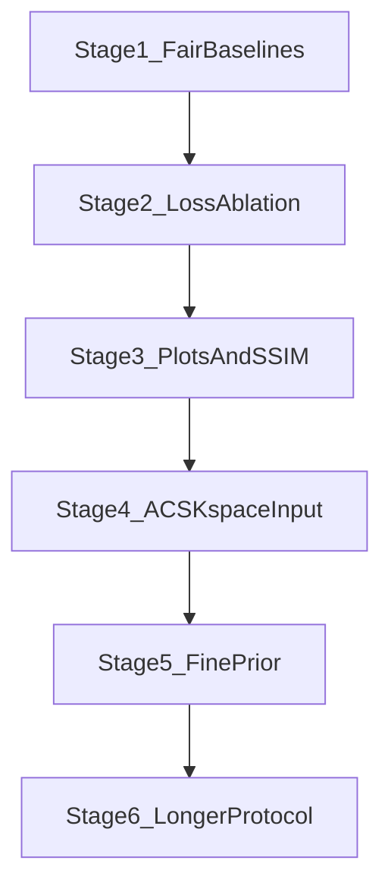

# FastMRI policy improvements

> **SUPERSEDED — see `fastmri_results.md`.** All Stage 1-6 numbers are
> training-set, single-draw, and use the pre-F9 NMSE (~4x low; see F9 in
> `fastmri_eval_integrity.md`). Masks were not budget-matched, which inflates
> learned-vs-`acs_random` margins by roughly 2x (F4). The headline "beats
> uniform random" survives; "beats the MRI baselines" does not. Kept as a
> development record.

Six-stage path after beating uniform random: fair MRI baselines, loss ablations, honest plots/metrics, ACS-kspace policy input, then (only if needed) a mask-sensitive fine prior and a 30-epoch protocol. Eval and report after every stage.

## Current checkpoint

`models_mask_gen_fastmri_nested/mask_gen_fastmri_final.pth`: k-space coarse D3PM + recon NMSE, \(\beta=0\), 1D row head. Beats **uniform random** at \(s=0.25\) (\(\Delta H_c \approx +0.20\), NMSE \(0.073\) vs \(0.266\)). Next question: is that more than rediscovering center-heavy PE sampling?

Do **not** load `models_mask_gen_fastmri/` (collapsed all-zero). Survival tables live next to the nested checkpoint (`fine_survival_table.pt`, `coarse_survival_table.pt`). If they are missing, rebuild coarse survival with `build_row_survival_table`; fine may be dummy `linspace(1, 0.01, n_t)` while `entropy_beta=0`.

Stop after each stage: run eval, report numbers, then continue.

## Status

- [x] Stage 1: equispaced / VD-Gaussian / ACS+random baselines; eval current policy vs all at \(s \in \{0.1, 0.25, 0.4\}\)
- [x] Stage 2: train NMSE-only, \(H_\text{coarse}\)-only, and both; eval vs baselines
- [x] Stage 3: plot \(Y\) and \(C\) on the same unnormalized magnitude; add SSIM/PSNR; re-eval/re-plot
- [x] Stage 4: condition the 1D mask head on scout ACS k-space, not row-pooled \(Z\); retrain + eval
- [x] Stage 5: frozen fine prior is not mask-sensitive — **keep \(\beta=0\)**; no \(\beta>0\) train
- [x] Stage 6: 30-epoch train on **image-Z `both`** (\(\beta=0\)); NMSE/\(H\) vs \(s \in \{0.1, 0.125, 0.25, 0.4\}\)

---

## Stage 1 — Fair MRI baselines

Add deterministic/stochastic **row-mask factories** (no extra nets):

| Name | Rule |
|------|------|
| `random` | uniform `floor(s H)` rows (existing) |
| `equispaced` | equally spaced PE lines, random offset |
| `vd_gaussian` | sample without replacement with \(p_i \propto \exp(-0.5((i-H/2)/(\sigma H/2))^2)\), \(\sigma=0.3\) |
| `acs_random` | always keep center `scout_size` (32) lines, fill remaining budget at random |

Eval the **current** learned policy vs all four at \(s\in\{0.1,0.25,0.4\}\) (10 batches). Report \(H_c\), NMSE, density. Plot one grid per baseline at \(s=0.25\).

**Do not retrain.** Load:

- Policy: `models_mask_gen_fastmri_nested/mask_gen_fastmri_final.pth`
- Coarse D3PM: `models_d3pm_fastmri_coarse_kspace/model_absorb_cosine_final.pth`
- Data: `FASTMRI_ROOT` or `/home/anvuong/data/fast_mri/singlecoil_train/`
- Config: `FastMRIConfig` defaults (`mask_objective="nested_d3pm"`, `entropy_beta=0`, `coarse_from_kspace=True`, `scout_size=32`, `image_size=300`)

Command: `uv run python eval_fastmri_policy.py` (load-only Stage 1 eval).

**Pass:** learned is meaningfully better than uniform random (already true). **Claim upgrade:** also beats VD and/or ACS+random.

### Stage 1 results (10 batches, load-only)

JSON: `models_mask_gen_fastmri_nested/eval/eval_baselines.json`.
Plots at \(s=0.25\): `learned_s025.png`, `random_s025.png`, `equispaced_s025.png`, `vd_gaussian_s025.png`, `acs_random_s025.png`.

Positive \(\Delta\) NMSE vs learned means the baseline is worse. Learned density overshoots the budget slightly.

| \(s\) | method | density | \(H_c\) | NMSE | \(\Delta\)NMSE vs learned | \(\Delta H_c\) vs learned |
|------|--------|---------|---------|------|---------------------------|---------------------------|
| 0.10 | learned | 0.125 | 0.161 | 0.212 | — | — |
| 0.10 | random | 0.100 | 0.341 | 0.400 | +0.188 | +0.180 |
| 0.10 | equispaced | 0.100 | 0.220 | 0.370 | +0.158 | +0.059 |
| 0.10 | vd_gaussian | 0.100 | 0.248 | 0.290 | +0.078 | +0.087 |
| 0.10 | acs_random | 0.100 | 0.140 | 0.013 | **−0.199** | −0.021 |
| 0.25 | learned | 0.263 | 0.101 | 0.093 | — | — |
| 0.25 | random | 0.250 | 0.302 | 0.293 | +0.201 | +0.201 |
| 0.25 | equispaced | 0.250 | 0.256 | 0.296 | +0.203 | +0.155 |
| 0.25 | vd_gaussian | 0.250 | 0.202 | 0.130 | +0.038 | +0.101 |
| 0.25 | acs_random | 0.250 | 0.203 | 0.010 | **−0.083** | +0.102 |
| 0.40 | learned | 0.415 | 0.102 | 0.019 | — | — |
| 0.40 | random | 0.400 | 0.276 | 0.233 | +0.215 | +0.174 |
| 0.40 | equispaced | 0.400 | 0.222 | 0.237 | +0.218 | +0.121 |
| 0.40 | vd_gaussian | 0.400 | 0.164 | 0.059 | +0.040 | +0.062 |
| 0.40 | acs_random | 0.400 | 0.200 | 0.007 | **−0.011** | +0.098 |

**Pass (vs uniform random):** yes at all three \(s\). **Claim upgrade:** beats VD-Gaussian on both NMSE and \(H_c\); does **not** beat ACS+random on NMSE (ACS wins by a large margin at \(s=0.10\) and \(0.25\); at \(s=0.10\), \(k=30<32\) so ACS is a centered block). Learned still has lower \(H_c\) than ACS at \(s=0.25\) and \(0.40\).

---

## Stage 2 — Loss ablation

Three 10-epoch trains, same arch/data, separate save dirs:

| Run | \(\alpha\) | \(\beta\) | `recon_loss_weight` | save_dir |
|-----|-----------|-----------|---------------------|----------|
| `both` | 1 | 0 | 1 (current) | `models_mask_gen_fastmri_nested/` — **not retrained** |
| `nmse_only` | 0 | 0 | 1 | `models_mask_gen_fastmri_nested/ablation_nmse_only/` |
| `hcoarse_only` | 1 | 0 | 0 | `models_mask_gen_fastmri_nested/ablation_hcoarse_only/` |

Eval each vs Stage 1 baselines at \(s=0.25\). Command: `uv run python train_fastmri_ablation.py`.

**Pass:** if `nmse_only` matches `both`, entropy is not buying the pattern; say so in the write-up.

### Stage 2 results (10 batches, \(s=0.25\))

JSON: `models_mask_gen_fastmri_nested/eval/eval_ablation_stage2.json`.
Plots: `eval/learned_both_s025.png`, `eval/learned_nmse_only_s025.png`, `eval/learned_hcoarse_only_s025.png` (copies also under each ablation `eval/`).

Parent `mask_gen_fastmri_final.pth` was not overwritten. Neither ablation collapsed (density stayed \(\sim 0.23\)–\(0.25\), \(H_c \ll \log 8\)).

Final-epoch train (EMA density; epoch-mean \(H_c\)/NMSE for ablations; last-batch \(H_c\)/NMSE for `both`'s original log):

| run | density | \(H_c\) | NMSE | collapse |
|-----|---------|---------|------|----------|
| both (reuse) | 0.235 | 0.109 | 0.066 | no |
| nmse_only | 0.254 | 0.175 | 0.142 | no |
| hcoarse_only | 0.251 | 0.169 | 0.142 | no |

Eval at \(s=0.25\):

| method | density | \(H_c\) | NMSE |
|--------|---------|---------|------|
| both | 0.267 | 0.101 | 0.091 |
| nmse_only | 0.250 | 0.168 | 0.133 |
| hcoarse_only | 0.230 | 0.165 | 0.136 |
| random | 0.250 | 0.301 | 0.285 |
| equispaced | 0.250 | 0.259 | 0.295 |
| vd_gaussian | 0.250 | 0.198 | 0.166 |
| acs_random | 0.250 | 0.203 | 0.009 |

**Pass (nmse_only matches both?):** no. `nmse_only` is worse on both NMSE (\(0.133\) vs \(0.091\)) and \(H_c\) (\(0.168\) vs \(0.101\)). Masks: `both` is center-heavy with scattered peripheral PE lines; `nmse_only` is a thicker central block with fewer outer lines. Entropy is buying part of the sampling pattern when paired with recon — it is not redundant. `hcoarse_only` lands near `nmse_only`, not `both`.

**ACS+random:** still much better NMSE (\(0.009\)) than any learned recipe. No learned loss mix beats ACS+random on reconstruction.

---

## Stage 3 — Honest plots and metrics

- Reconstruct **unnormalized** magnitude for both \(Y\) and full \(C\) in `plot_fastmri_grid` (stop mixing z-scored \(C\) with raw \(Y\)).
- Add SSIM and PSNR (same scale as NMSE).
- Re-plot learned + baselines; re-eval JSON includes SSIM/PSNR.

**Do not retrain.** Load the Stage 2 `both` checkpoint (and ablation ckpts for extra plots only).

### Stage 3 results (10 batches, load-only)

JSON: `models_mask_gen_fastmri_nested/eval/eval_baselines.json`.
Honest plots at \(s=0.25\) (shared per-sample clim from full unnormalized mag, 99.5th percentile; savefig only): `learned_s025.png`, `random_s025.png`, `equispaced_s025.png`, `vd_gaussian_s025.png`, `acs_random_s025.png`, plus ablations `learned_nmse_only_s025.png`, `learned_hcoarse_only_s025.png`.

`plot_fastmri_grid` now takes optional `kspace`. When set, the last two columns are `magnitude_from_kspace(K)` and `apply_kspace_row_mask(K)` on the **same** vmin/vmax. Dataloader \(C\) is z-scored and is not used as visual GT. Scout \(Z\) is unchanged (policy input).

SSIM / PSNR live in `itw/discrete.py` next to `nmse`, on the same unnormalized pair. SSIM peak-normalizes per sample (equivalent to `data_range=max(target)`, stable at FastMRI mag \(\sim 10^{-6}\)). PSNR does not floor MSE at \(10^{-8}\) (that floor made every method identical \(\approx -38\) dB). Tests in `tests/test_kspace_row.py`.

No training. Parent `mask_gen_fastmri_final.pth` was not overwritten. Shuffle + Gumbel so NMSE/\(H_c\) differ slightly from Stages 1–2; ranking is unchanged.

| \(s\) | method | density | \(H_c\) | NMSE | SSIM | PSNR |
|------|--------|---------|---------|------|------|------|
| 0.10 | learned | 0.125 | 0.156 | 0.191 | 0.446 | 19.46 |
| 0.10 | random | 0.100 | 0.339 | 0.429 | 0.359 | 16.00 |
| 0.10 | equispaced | 0.100 | 0.217 | 0.392 | 0.364 | 16.28 |
| 0.10 | vd_gaussian | 0.100 | 0.252 | 0.321 | 0.395 | 17.55 |
| 0.10 | acs_random | 0.100 | 0.140 | **0.012** | **0.658** | **29.57** |
| 0.25 | learned | 0.264 | 0.107 | 0.086 | 0.587 | 24.13 |
| 0.25 | nmse_only | 0.252 | 0.165 | 0.127 | 0.550 | 22.43 |
| 0.25 | hcoarse_only | 0.232 | 0.162 | 0.153 | 0.507 | 21.34 |
| 0.25 | random | 0.250 | 0.315 | 0.331 | 0.407 | 17.10 |
| 0.25 | equispaced | 0.250 | 0.257 | 0.287 | 0.409 | 17.45 |
| 0.25 | vd_gaussian | 0.250 | 0.213 | 0.146 | 0.524 | 21.56 |
| 0.25 | acs_random | 0.250 | 0.201 | **0.010** | **0.728** | **30.41** |
| 0.40 | learned | 0.418 | 0.107 | 0.029 | 0.743 | 29.86 |
| 0.40 | random | 0.400 | 0.274 | 0.231 | 0.485 | 19.02 |
| 0.40 | equispaced | 0.400 | 0.227 | 0.225 | 0.490 | 18.50 |
| 0.40 | vd_gaussian | 0.400 | 0.168 | 0.062 | 0.671 | 26.37 |
| 0.40 | acs_random | 0.400 | 0.199 | **0.007** | **0.784** | **31.86** |

SSIM/PSNR agree with NMSE: learned beats uniform random, equispaced, and VD-Gaussian; **ACS+random still wins reconstruction** at all three \(s\). At \(s=0.25\), `both` still beats `nmse_only` and `hcoarse_only` on NMSE/SSIM/PSNR and \(H_c\). Learned keeps lower \(H_c\) than ACS at \(s=0.25\) and \(0.40\).

---

## Stage 4 — Policy input = scout k-space

Condition `CartesianRowMaskGenerator` on the **ACS k-space strip** (center `scout_size` PE lines), not image-domain row-pooled \(Z\). Retrain `both` 10 epochs. Eval vs Stage 1 baselines.

### Stage 4 results (10-epoch retrain + 10-batch eval)

API: `FastMRIConfig.policy_input: Literal["scout_image","acs_kspace"] = "scout_image"` (default keeps the parent image-\(Z\) path). `CartesianRowMaskGenerator(in_kind=...)` matches that flag. ACS extract: center 32 PE lines of complex \(K\) as real+imag `[B, 2, 32, W]`; 2D conv (hidden 64), pool frequency, linear upsample to \(H=300\), then the 1D keep/drop head (`[B, 1, H, 2]`). Recipe: `both` (\(\alpha=1\), \(\beta=0\), `recon_loss_weight=1`), sparsity weight 50, \(s\in[0.1,0.4]\), batch 8, lr \(10^{-4}\).

Save dir: `models_mask_gen_fastmri_nested/acs_kspace_input/` (parent `mask_gen_fastmri_final.pth` not overwritten). Coarse survival reused from the parent nested dir; fine is dummy linspace. Command: `uv run python train_fastmri_acs_input.py`.

Train (no collapse; density stayed \(\sim 0.17\)–\(0.29\), \(H_c\) stuck \(\approx 0.30\)):

| epoch | density | \(H_c\) | NMSE |
|-------|---------|---------|------|
| 0 | 0.293 | 0.301 | 0.311 |
| 1 | 0.169 | 0.303 | 0.356 |
| 5 | 0.199 | 0.303 | 0.335 |
| 9 | 0.214 | 0.304 | 0.321 |

Eval JSON: `models_mask_gen_fastmri_nested/acs_kspace_input/eval/eval_baselines.json`. Honest plots at \(s=0.25\): `learned_s025.png`, `random_s025.png`, `equispaced_s025.png`, `vd_gaussian_s025.png`, `acs_random_s025.png`. Ckpt: `acs_kspace_input/mask_gen_fastmri_final.pth`.

| \(s\) | method | density | \(H_c\) | NMSE | SSIM | PSNR |
|------|--------|---------|---------|------|------|------|
| 0.10 | learned_acs_input | 0.099 | 0.334 | 0.433 | 0.353 | 16.16 |
| 0.10 | random | 0.100 | 0.339 | 0.435 | 0.356 | 16.16 |
| 0.10 | equispaced | 0.100 | 0.219 | 0.419 | 0.357 | 16.37 |
| 0.10 | vd_gaussian | 0.100 | 0.250 | 0.328 | 0.384 | 17.59 |
| 0.10 | acs_random | 0.100 | 0.140 | **0.013** | **0.651** | **29.54** |
| 0.25 | learned_acs_input | 0.224 | 0.313 | 0.298 | 0.413 | 17.38 |
| 0.25 | random | 0.250 | 0.310 | 0.282 | 0.434 | 18.06 |
| 0.25 | equispaced | 0.250 | 0.262 | 0.261 | 0.422 | 17.78 |
| 0.25 | vd_gaussian | 0.250 | 0.200 | 0.126 | 0.538 | 21.76 |
| 0.25 | acs_random | 0.250 | 0.204 | **0.009** | **0.741** | **30.63** |
| 0.40 | learned_acs_input | 0.411 | 0.274 | 0.243 | 0.500 | 19.21 |
| 0.40 | random | 0.400 | 0.271 | 0.203 | 0.516 | 19.67 |
| 0.40 | equispaced | 0.400 | 0.221 | 0.234 | 0.502 | 18.70 |
| 0.40 | vd_gaussian | 0.400 | 0.173 | 0.075 | 0.666 | 25.97 |
| 0.40 | acs_random | 0.400 | 0.203 | **0.007** | **0.803** | **32.42** |

At \(s=0.25\) vs Stage 3 image-\(Z\) `both`: ACS-input NMSE **0.298** / SSIM 0.413 / PSNR 17.4 vs image-\(Z\) **0.086** / 0.587 / 24.1. ACS+random remains \(\approx 0.009\) / 0.741 / 30.6.

**Did ACS-kspace input beat ACS+random on NMSE?** no (0.298 vs 0.009 at \(s=0.25\); similar gap at 0.10 and 0.40). **Did it beat the old image-\(Z\) policy?** no — it is near (or slightly worse than) uniform random, and \(H_c\) never left the random regime. Linear upsample from 32 ACS PE features onto 300 full-FOV logits likely breaks PE alignment, so the head does not rediscover a center-heavy mask.

Parent image-\(Z\) checkpoint was not overwritten. Tests: `uv run pytest` on `tests/test_kspace_row.py` + existing suite (26 passed).

---

## Stage 5 — Fine prior (only if 1–4 leave a gap)

Do **not** set \(\beta>0\) until fine CE moves with \(t\) and with mask density. Options: more bins / no min-max on z-scored mag; or keep \(\beta=0\).

### Stage 5 results (2026-08-28, 4×8 GPU batches, load-only)

JSON: `models_mask_gen_fastmri_nested/eval/eval_fine_prior_stage5.json` (copy under gitignored `models_d3pm_fastmri_fine/eval/`). Plots: `eval/stage5_ce_vs_t.png`, `eval/stage5_h_fine_vs_mask.png`. Command: `uv run python eval_fastmri_priors.py --stage5 --max-batches 4`. Device: cuda. Fine ckpt: `models_d3pm_fastmri_fine/model_absorb_cosine_final.pth`. Image-Z policy loaded for \(H_\text{fine}\) only; **parent `mask_gen_fastmri_final.pth` was not overwritten.** No fine D3PM retrain. `magnitude_to_fine_disc` unchanged (no one-line bug).

Dummy fine survival `linspace(1, 0.01, 1000)` as in the \(\beta=0\) nested protocol; \(s=0.25\) maps to \(t=757\). D3PM `q_sample` indexes `q_mats[t-1]`, so requested \(t=0\) is clamped to \(t=1\). Chance \(\log 8 = 2.079\).

Fine CE vs \(t\) on real 96×96 8-bin discs from magnitude:

| \(t\) | CE (nats) |
|-------|-----------|
| 0 (→1) | 0.614 |
| 1 | 0.614 |
| 100 | 0.614 |
| 500 | 0.612 |
| 757 (\(s=0.25\)) | 0.614 |
| 999 | 0.967 |

CE is **flat** on \(t\in\{1,100,500,757\}\) (span \(0.002\)). The \(t=999\) rise is absorb-end, not a usable CE(\(t\)) for mask densities \(0.1\)–\(0.4\).

\(H_\text{fine}\) at the survival-mapped operating \(t=757\), \(s=0.25\):

| mask | density | \(H_\text{fine}\) |
|------|---------|-------------------|
| empty | 0.000 | 0.678 |
| full_ones | 1.000 | 0.623 |
| random | 0.250 | 0.619 |
| vd_gaussian | 0.250 | 0.613 |
| acs_random | 0.250 | 0.626 |
| learned_image_z | 0.264 | 0.627 |

Among real \(s=0.25\) patterns (random / VD / ACS / learned) span \(= 0.014\). ACS is **not** lower than random. Density-matched \(t\): empty \(H_\text{fine}=0.630\) at \(t=1000\) vs full \(0.627\) at \(t=1\) (span \(0.002\)). Same-\(t\) empty vs full is only \(0.055\) nats and does not rank ACS above random.

Bin-0 fraction on the same 32 slices: **0.532** (hist \(\approx [0.532, 0.255, 0.133, 0.058, 0.015, 0.005, 0.002, 0.000]\)). Skewed, not a discretization crash; no code change.

**Decision: keep \(\beta=0\).** Fine CE is flat in \(t\) on the nested operating range, and \(H_\text{fine}\) does not move with mask density or pattern, so a \(\beta>0\) policy would have no signal. Do not train \(\beta>0\). A longer fine D3PM retrain (more bins / drop min-max on z-scored mag) is **not** justified as a Stage 5 smoke — it would still not unlock \(\beta>0\) without new CE(\(t\))/ \(H_\text{fine}\)(mask) evidence.

**Winning recipe for Stage 6** (image-Z `both`; Stage 4 ACS-kspace is a **failed architecture**, PE upsample \(32\to 300\), not the protocol default):

| knob | value |
|------|--------|
| ckpt | `models_mask_gen_fastmri_nested/mask_gen_fastmri_final.pth` |
| `policy_input` | `scout_image` |
| \(\alpha\) | 1 |
| \(\beta\) | **0** |
| `recon_loss_weight` | 1 |

Optional later (not implemented): a PE-aligned ACS head (no linear \(32\to 300\) upsample) might help the remaining ACS+random **reconstruction** gap. That is orthogonal to nested fine entropy.

---

## Stage 6 — Protocol

30 epochs on the Stage 5 winning recipe: **image-Z `both`**, \(\alpha=1\), \(\beta=0\), `recon_loss_weight=1`, `policy_input="scout_image"`. Do **not** use Stage 4 ACS-kspace as the protocol default. Curve: NMSE / \(H_c\) / SSIM vs \(s\in\{0.1, 0.125, 0.25, 0.4\}\).

### Stage 6 results (from-scratch 30-epoch train + 10-batch eval)

Command: `uv run python train_fastmri_protocol.py`. Save dir: `models_mask_gen_fastmri_nested/protocol_30ep/` (parent `mask_gen_fastmri_final.pth` not overwritten; mtime unchanged). **Init: from scratch** (not warm-started from the 10-epoch image-\(Z\) ckpt). Coarse D3PM and `coarse_survival_table.pt` reused from the parent nested dir; fine survival is dummy linspace. `save_every=5` kept epochs 4/9/14/19/24/29. Device: cuda.

Train (no collapse; density stayed \(\sim 0.22\)–\(0.37\), \(H_c\) well below \(\log 8\)):

| epoch | density | \(H_c\) | NMSE |
|-------|---------|---------|------|
| 0 | 0.367 | 0.267 | 0.206 |
| 1 | 0.218 | 0.186 | 0.155 |
| 9 | 0.263 | 0.111 | 0.109 |
| 19 | 0.260 | 0.084 | 0.110 |
| 29 | 0.244 | 0.077 | 0.108 |

Train NMSE plateaued by epoch \(\sim 5\)–7; extra epochs mainly lowered \(H_c\) (0.267 \(\to\) 0.077).

Eval JSON: `protocol_30ep/eval/eval_baselines.json`. Honest plots at \(s=0.25\): `learned_s025.png`, `random_s025.png`, `equispaced_s025.png`, `vd_gaussian_s025.png`, `acs_random_s025.png`. Curve: `nmse_ssim_vs_s.png` (learned_30ep vs ACS+random / vd_gaussian / random, with Stage 3 10-epoch overlay at \(s=0.10/0.25/0.40\)). Ckpt: `protocol_30ep/mask_gen_fastmri_final.pth`.

| \(s\) | method | density | \(H_c\) | NMSE | SSIM | PSNR |
|------|--------|---------|---------|------|------|------|
| 0.10 | learned_30ep | 0.100 | 0.145 | 0.225 | 0.403 | 18.65 |
| 0.10 | random | 0.100 | 0.337 | 0.393 | 0.353 | 16.30 |
| 0.10 | equispaced | 0.100 | 0.226 | 0.373 | 0.352 | 16.27 |
| 0.10 | vd_gaussian | 0.100 | 0.257 | 0.307 | 0.383 | 17.70 |
| 0.10 | acs_random | 0.100 | 0.139 | **0.013** | **0.627** | **28.98** |
| 0.125 | learned_30ep | 0.125 | 0.124 | 0.285 | 0.431 | 18.60 |
| 0.125 | random | 0.123 | 0.313 | 0.420 | 0.385 | 16.44 |
| 0.125 | equispaced | 0.123 | 0.197 | 0.429 | 0.382 | 16.47 |
| 0.125 | vd_gaussian | 0.123 | 0.238 | 0.295 | 0.420 | 18.06 |
| 0.125 | acs_random | 0.123 | 0.144 | **0.012** | **0.693** | **30.20** |
| 0.25 | learned_30ep | 0.263 | 0.074 | 0.107 | 0.595 | 24.31 |
| 0.25 | random | 0.250 | 0.312 | 0.306 | 0.420 | 17.57 |
| 0.25 | equispaced | 0.250 | 0.259 | 0.285 | 0.411 | 17.62 |
| 0.25 | vd_gaussian | 0.250 | 0.206 | 0.150 | 0.510 | 21.12 |
| 0.25 | acs_random | 0.250 | 0.208 | **0.010** | **0.730** | **30.45** |
| 0.40 | learned_30ep | 0.370 | 0.044 | 0.019 | 0.774 | 31.77 |
| 0.40 | random | 0.400 | 0.272 | 0.183 | 0.516 | 20.11 |
| 0.40 | equispaced | 0.400 | 0.219 | 0.190 | 0.503 | 19.18 |
| 0.40 | vd_gaussian | 0.400 | 0.170 | 0.060 | 0.686 | 27.19 |
| 0.40 | acs_random | 0.400 | 0.206 | **0.007** | **0.787** | **31.79** |

Vs Stage 3 10-epoch image-\(Z\) `both` (overlapping \(s\) only):

| \(s\) | 10ep NMSE / SSIM / \(H_c\) | 30ep NMSE / SSIM / \(H_c\) |
|------|----------------------------|----------------------------|
| 0.10 | 0.191 / 0.446 / 0.156 | 0.225 / 0.403 / 0.145 |
| 0.25 | 0.086 / 0.587 / 0.107 | 0.107 / 0.595 / 0.074 |
| 0.40 | 0.029 / 0.743 / 0.107 | 0.019 / 0.774 / 0.044 |

**Did 30 epochs beat ACS+random on NMSE?** no (0.225 vs 0.013 at \(s=0.10\); 0.107 vs 0.010 at \(s=0.25\); 0.019 vs 0.007 at \(s=0.40\)). The ACS gap is essentially unchanged. **Did it beat the 10-epoch image-\(Z\) ckpt?** mixed: lower \(H_c\) at all three \(s\); worse NMSE at 0.10 and 0.25; better NMSE/SSIM/PSNR at 0.40. From-scratch + slower Gumbel anneal (\(\tau=0.5\) only at epoch 29) is not a strict continuation of the 10-epoch run.

Learned still beats uniform random, equispaced, and VD-Gaussian on NMSE/SSIM at \(s=0.10/0.25/0.40\). At \(s=0.125\), NMSE is non-monotonic vs \(s=0.10\) (0.285 vs 0.225) while SSIM still rises; 10-batch Gumbel eval, not a density collapse. Density at \(s=0.40\) undershoots (0.370 vs 0.40).

Tests: `uv run pytest` (27 passed). No Stage 7.

**Six-stage outcome:** Fair MRI baselines showed the nested image-\(Z\) policy beats uniform random, equispaced, and VD-Gaussian but not ACS+random. Loss ablation said entropy+NMSE together beat either term alone. Honest plots/SSIM/PSNR confirmed the ranking. ACS-kspace policy input failed (near-random, PE upsample \(32\to 300\)). Fine D3PM CE is flat in \(t\) and \(H_\text{fine}\) is mask-insensitive, so \(\beta=0\) stays. Thirty from-scratch epochs lowered \(H_c\) further but did **not** close the ACS reconstruction gap; extra length is not a substitute for ACS-aware sampling.

**ACS remainder (A1–A4):** the ACS NMSE gap is a sampling constraint, not a longer train. Ship `acs_lock=True`, image-\(Z\) `both`, \(\beta=0\), ckpt `models_mask_gen_fastmri_nested/acs_lock_10ep/mask_gen_fastmri_final.pth`. Do not ship unconstrained Gumbel. A3 PE-aligned ACS cond was skipped (A2 already beats ACS+random / ACS+VD). Full numbers, curve, and recipe: `docs/fastmri_acs_remainder.md`.

