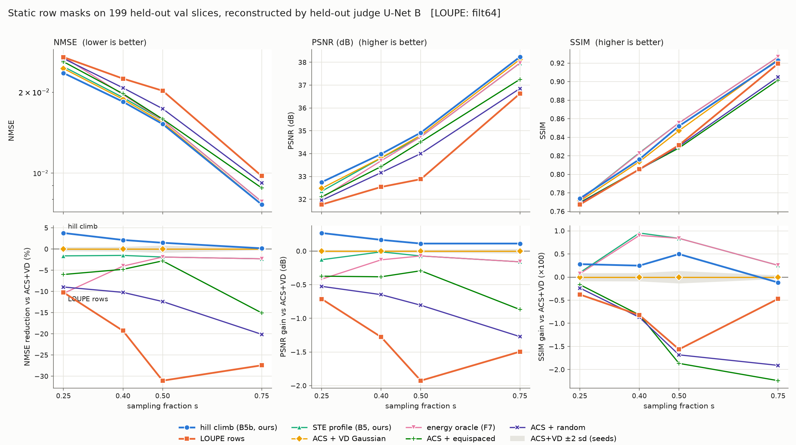
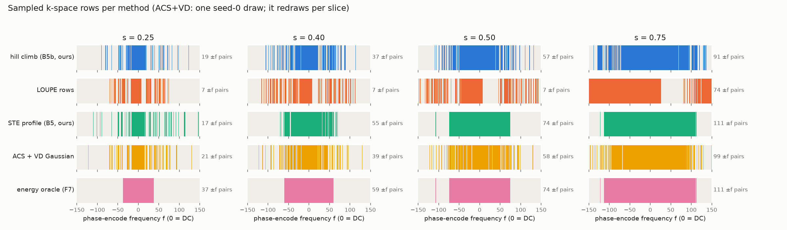
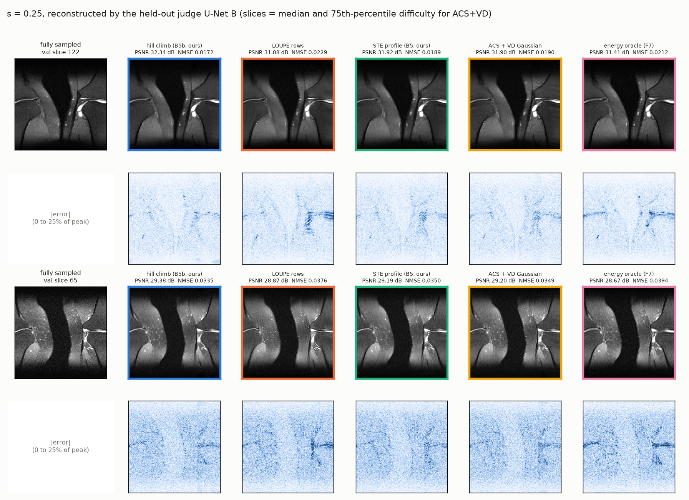

# LOUPE baseline — results

> **Status: complete, 2026-09-18.** All four `rows` runs (s = 0.25, 0.40,
> 0.50, 0.75, `filt 64`) are converged and scored by the held-out judge, and so
> is the `filt 32` capacity control at s=0.25. The optional `native` 2D variant
> was not run. Merged results are in
> `models_mask_gen_fastmri_nested/eval_val/eval_loupe.json`; per-run files,
> including the full training histories, are in `eval_val/loupe/`. Resume
> instructions and design rationale: `docs/loupe_handoff.md`.

## Why this baseline

`docs/fastmri_results.md` claims our hill-climbed static row mask (B5b) beats
the best heuristic, `acs_vd_gaussian`. LOUPE (Bahadir et al. 2020) is the
standard relaxation-based method for learning an MRI sampling pattern, so the
claim only means something if it holds against LOUPE too.

## Headline

At s=0.25, under the held-out judge U-Net B, **LOUPE's learned mask (main
config, `filt 64`) is 14.6% worse than our hill-climbed mask** (0.02698 vs
0.02355) and 10.2% worse than `acs_vd_gaussian` (0.02448). It only just beats
the energy oracle (F7, 0.02703). The `filt 32` capacity control does a little
better (0.02615, 11.0% behind ours), but it still loses to everything except
the energy oracle. This is despite LOUPE training its reconstructor
jointly with the mask, an advantage our method does not get.

**LOUPE loses at every sparsity, and the gap grows with s:**

| s | ours | LOUPE | LOUPE vs ours | LOUPE vs `acs_vd_gaussian` |
|---|------|-------|---------------|----------------------------|
| 0.25 | 0.02355 | 0.02698 | +14.6% | +10.2% |
| 0.40 | 0.01842 | 0.02245 | +21.9% | +19.3% |
| 0.50 | 0.01521 | 0.02024 | +33.1% | +31.1% |
| 0.75 | 0.00763 | 0.00974 | +27.7% | +27.3% |

At s = 0.40, 0.50 and 0.75 it is worse than every other mask tested, including
`acs_random`. The same ranking holds under U-Net A, under plain zero-filled
reconstruction, and on PSNR. On SSIM LOUPE is also below ours at every s, but
the SSIM gaps are small; see Figures. **The paper's positive claim stands.** Our
hill-climbed mask remains the best tested mask on NMSE and PSNR, and LOUPE does
not come close.

## Results

Val NMSE on the 199-slice held-out split. Lower is better, and **bold** marks
the best at each s. The ranking uses **U-Net B**, the judge that was never used
in any optimisation, ours or LOUPE's.

### Under the held-out judge (U-Net B)

| method | s=0.25 | s=0.40 | s=0.50 | s=0.75 |
|--------|--------|--------|--------|--------|
| **hill climb (B5b, ours)** | **0.02355** | **0.01842** | **0.01521** | **0.00763** |
| acs_vd_gaussian (5 seeds) | 0.02448 ± 0.00006 | 0.01882 ± 0.00005 | 0.01544 ± 0.00007 | 0.00765 ± 0.00001 |
| STE profile (B5, ours) | 0.02487 | 0.01910 | 0.01573 | 0.00782 |
| LOUPE rows, `filt 32` (capacity control) | 0.02615 | — | — | — |
| LOUPE rows, `filt 64` (main) | 0.02698 | 0.02245 | 0.02024 | 0.00974 |
| energy oracle (F7) | 0.02703 | 0.01958 | 0.01573 | 0.00782 |
| acs_equispaced (5 seeds)† | 0.02594 | 0.01972 | 0.01587 | 0.00880 |
| acs_random (5 seeds)† | 0.02667 | 0.02074 | 0.01735 | 0.00919 |

† Re-scored by `plot_mask_comparison.py` with its own 5-seed stream, so they
differ from `docs/fastmri_results.md` in the 4th significant digit.

The `ours_hillclimb` and `acs_vd_gaussian` values were re-scored on this machine
by `train_loupe_baseline.py` and match the committed values from the old machine
(e.g. 0.023548 and 0.024475 at s=0.25). That confirms the copied data and
reconstructor checkpoints are identical.

**Which `acs_vd_gaussian` number is used.** This table uses the values
`eval_b5b_hillclimb.json` scores alongside the hill-climb mask, at every s.
`eval_b5_profile.json` scores the same heuristic with a different seed stream.
The paper's margin table (`docs/fastmri_results.md` §Results, `docs/paper.md`
§6.4, `docs/latex/main.tex`) prints the B5 values but computes its margins
from the B5b ones. That mismatch was already there before this work:

| s | printed (B5 eval) | used for margin (B5b eval) | printed margin | margin vs printed value |
|---|---|---|---|---|
| 0.25 | 0.02450 | 0.02448 | +3.79% | +3.88% |
| 0.40 | 0.01873 | 0.01882 | +2.14% | +1.66% |
| 0.50 | 0.01538 | 0.01544 | +1.49% | +1.11% |
| 0.75 | 0.00764 | 0.00765 | +0.18% | +0.13% |

No verdict changes: the s=0.25–0.50 wins stay above 2 sd, and s=0.75 stays a
tie. Fix it when the LOUPE row is added by printing each value next to the
margin computed from that same evaluation.
`train_loupe_baseline.py` re-scores `acs_vd_gaussian` at every s, so the final
LOUPE table will carry its own value.

### All three reconstructors

| s | mask | U-Net B (judge) | U-Net A | zero-filled |
|---|------|-----------------|---------|-------------|
| 0.25 | **hill climb (ours)** | **0.02355** | **0.02426** | **0.03274** |
| | acs_vd_gaussian | 0.02448 | 0.02550 | 0.03382 |
| | LOUPE `filt 32` | 0.02615 | 0.02749 | 0.03456 |
| | LOUPE `filt 64` | 0.02698 | 0.02840 | 0.03535 |
| 0.40 | **hill climb (ours)** | **0.01842** | **0.01892** | **0.02249** |
| | acs_vd_gaussian | 0.01882 | 0.01939 | 0.02304 |
| | LOUPE `filt 64` | 0.02245 | 0.02352 | 0.02880 |
| 0.50 | **hill climb (ours)** | **0.01521** | **0.01547** | **0.01719** |
| | acs_vd_gaussian | 0.01544 | 0.01576 | 0.01768 |
| | LOUPE `filt 64` | 0.02024 | 0.02064 | 0.02487 |
| 0.75 | **hill climb (ours)** | **0.00763** | **0.00778** | 0.00803 |
| | acs_vd_gaussian | 0.00765 | 0.00779 | **0.00798** |
| | LOUPE `filt 64` | 0.00974 | 0.00990 | 0.01040 |

LOUPE loses under all three reconstructors at every s, including plain
zero-filled reconstruction. So the gap does not come from one U-Net's quirks.
LOUPE never saw U-Net A or B: it trains its own U-Net jointly with its mask, and
only its learned mask is handed to A and B for scoring, exactly like every other
mask. Both scoring U-Nets were trained only under heuristic masks (six families,
s uniform in [0.10, 0.75]), never under a learned mask.

### Figures

Made by `plot_mask_comparison.py`. Run `--score` first to re-score on GPU; a
plain run just redraws from the cache. Output goes to
`models_mask_gen_fastmri_nested/eval_val/mask_comparison/`, which is
gitignored. The copies embedded here are in `docs/figures/loupe/`; copy them
again after a re-run.



The top row shows absolute values. The bottom row shows each metric relative to
`acs_vd_gaussian`, oriented so that up is always better, with its ±2 sd seed
band in grey. `metrics_vs_s_zf.png` and `metrics_vs_s_unetA.png` show the same
thing for the other two reconstructors. Things to note:

- **PSNR agrees with NMSE.** Hill climb is best at every s: +0.27 dB over
  ACS+VD at s=0.25 and +0.11 dB at s=0.75. LOUPE is −0.71, −1.28, −1.93 and −1.49 dB at s = 0.25, 0.40, 0.50 and 0.75.
- **SSIM does not fully agree.** At s=0.40, 0.50 and 0.75 the B5 profile and
  the energy oracle beat hill climb on SSIM, by 0.70, 0.34 and 0.37 points
  (×100), even though they lose on NMSE and PSNR. At s=0.75 hill climb is
  marginally *below* ACS+VD on SSIM (−0.12). Hill climb still beats ACS+VD on
  SSIM at s=0.25–0.50. Hill climb optimises NMSE, and SSIM rewards the smoother,
  contiguous masks those two produce. Any claim in the paper should say
  "best on NMSE/PSNR", not "best" without qualification. LOUPE is below ours on
  SSIM at every s, by 0.3–2.1 points (×100). At s=0.40 and 0.50 it is near the
  bottom, level with ACS+random.



This shows the mechanism described in the next section. LOUPE keeps exactly 7
mirrored ±f pairs at s = 0.25, 0.40 and 0.50, while ours grows from 19 to 57.
At s=0.75 LOUPE samples one solid half of k-space.



The two val slices are picked by `acs_vd_gaussian`'s own difficulty (median and
75th percentile), not by any method's result. On both slices hill climb has the
best PSNR and NMSE. LOUPE's error maps show horizontal ringing around sharp
edges, which is the phase-encode direction. That is the artefact expected from
missing high-|f| rows. The images are re-centred for display only; see the note
in the next paragraph.

*Display note.* `magnitude_from_kspace` (`itw/masks.py`) leaves the image origin
at the corner, so every image in this pipeline is circularly shifted by H/2
vertically. That applies to training targets, reconstructions, and both
U-Nets' inputs alike. NMSE and PSNR are invariant to that shift and SSIM is
changed only by border effects, so no number here is affected. The example
figure rolls the images back for display.

## Why LOUPE's mask loses: it avoids mirrored rows

LOUPE's forward model FFTs a *real* magnitude image (handoff caveat 1). That
makes its k-space Hermitian, so row `+f` and row `−f` carry the same
information. The masks it learns behave exactly as that assumption predicts:
they almost never sample both halves of a `±f` pair.

| mask (s=0.25, 75 rows) | distinct \|f\| covered | pairs with both ±f | rows whose mirror is missing | contiguous centre block |
|------|------|------|------|------|
| LOUPE `filt 64` (converged) | 68 | 7 | 60 | 16 rows |
| LOUPE `filt 32` (converged) | 67 | 8 | 58 | 18 rows |
| hill climb (ours) | 56 | 19 | 36 | 33 rows |

At s=0.40 the pattern is even stronger. LOUPE's converged mask has 120 rows
covering **113 distinct |f|**, with only **7 mirrored pairs**, against 83 and
37 for our mask. Its fully sampled centre is still only 16 rows wide. It shares
65 of 120 rows with our mask.

The same count at every sparsity shows it is structural:

| s | LOUPE rows f<0 / f>0 | LOUPE ±f pairs | ours ±f pairs |
|---|---|---|---|
| 0.25 | 39 / 35 | 7 | 19 |
| 0.40 | 68 / 51 | 7 | 37 |
| 0.50 | 90 / 59 | 7 | 57 |
| 0.75 | **150 / 74** | 74 | 91 |

From s=0.25 to s=0.50 LOUPE doubles its budget but adds **no** mirrored pairs.
Every extra row goes to a new |f|. At s=0.75 it samples **all 150 negative
frequencies** plus DC, which is a textbook partial-Fourier (half-k-space)
pattern. Under a Hermitian assumption one half of k-space determines the other,
so this is exactly the right choice. Only after that half is full does it spend
the remaining 74 rows on the positive side, where it has no choice left.

On LOUPE's own problem this is optimal: one side of each pair spreads the budget
over more distinct frequencies. On true complex k-space the two sides are **not**
redundant. Phase makes `+f` and `−f` carry different information, and the
mirror-free mask throws that away. In particular, LOUPE's fully sampled centre is
only 16–18 rows wide against our 33. It also never reaches past |f| = 74, while
our mask spends a few rows as far out as |f| = 123.

This is the most plausible explanation for the gap, and it is a direct result of
LOUPE's design, not of how we used it. It is a correlational observation, not a
controlled test. The controlled test would retrain LOUPE on complex k-space,
which is a different method and outside the scope of this baseline.

## Convergence

Runs stop when the budget-exact top-k row set has not changed for **20
consecutive epochs**. The minimum is 50 epochs and the hard cap is 1000. The
handoff (`docs/loupe_handoff.md` §2) asks for this in place of LOUPE's published
60 epochs, which on our 973-image split would give about 60× less optimisation
than LOUPE was published with.

**Stop rule, amended for s ≥ 0.50.** At s=0.50 and 0.75, LOUPE leaves about
100 rows with nearly tied probabilities around the top-k cut. At s=0.50, epoch
100, the neighbours at the cut differ by ~6e-4 (p ≈ 0.88); at s=0.75, epoch 40,
they differ by ~4e-4 (p ≈ 0.64). Tiny updates keep swapping 1–3 of those rows
every epoch, while val NMSE stays flat (U-Net A 0.01977 → 0.01976 over epochs
90–100 at s=0.50). The strict rule would never fire, so these runs would go to
the 1000-epoch cap. We therefore count an epoch as settled if churn is **at most
2% of the row budget**: ≤1 row at s=0.25, ≤2 at 0.40, ≤3 at 0.50 and ≤4 at 0.75.
The run stops after 20 such epochs in a row. s=0.25 and 0.40 met the stricter
zero-churn rule anyway, so all four runs satisfy the amended rule. The s=0.50
and 0.75 runs resumed from their epoch-110 and epoch-50 checkpoints. s=0.50
already met the amended rule at resume, so it was not trained further. Their
pre-resume logs are `logs_loupe/rows_s{50,75}.part1.log`.

| run | stopped at | optimiser steps | churn over last 20 epochs |
|-----|-----------|-----------------|---------------------------|
| rows s=0.25 `filt 32` | epoch 62 (converged) | 7,686 | all 0 |
| rows s=0.25 `filt 64` | epoch 74 (converged) | 9,150 | all 0 |
| rows s=0.40 `filt 64` | epoch 95 (converged) | 11,712 | all 0 |
| rows s=0.50 `filt 64` | epoch 110 (converged, ≤3 rule) | 13,542 | 1–3 rows each epoch |
| rows s=0.75 `filt 64` | epoch 64 (converged, ≤4 rule) | 7,930 | 0–4, last six epochs all 0 |

Row-set churn for s=0.25 `filt 64`, epochs 0–74. It decays steadily from 5–6
rows per epoch to 0 and holds at 0 from epoch 55:

```
1 6 5 6 5 3 1 3 4 2 1 2 3 2 2 4 2 1 0 2 3 0 1 0 1 1 1 0 0 1 1 0 1 0 1 0 1 0 1 0
1 0 0 0 0 0 0 0 0 1 0 1 0 0 1 0 0 0 0 0 0 0 0 0 0 0 0 0 0 0 0 0 0 0 0
```

**Convergence is partly saturation.** By the time churn reaches 0, 10–14% of the
row probabilities are pinned at 0 or 1 (`p_sat`), rising to 23% by the stop, and the mask-logit gradient
has fallen from about 3.5e-4 to about 1.3e-5. The row set stops moving because
the sigmoid has committed, not only because the mask is at an optimum. This is
LOUPE's own behaviour, not a defect of the port. Validation NMSE gets slightly *worse* over the
same stretch (U-Net A 0.0274 at epoch 50 → 0.0284 from epoch 60 on), so training
longer would not help LOUPE. Stopping earlier would have helped a little. We do
not pick the epoch on val, because that would tune LOUPE on the evaluation
split. Even the best mid-training U-Net A value (0.02736) is behind both ours
(0.02426) and `acs_vd_gaussian` (0.02550).

## Capacity control

The handoff asked for one `filt 32` run at s=0.25, to check that the learned
*mask* does not depend on reconstructor width.

- **Row sets:** the two converged masks share **72 of 75 rows**. By
  comparison, LOUPE `filt 64` shares only 38 of 75 rows with our hill-climbed
  mask.
- **Judge score:** 0.02615 (`filt 32`) vs 0.02698 (`filt 64`). Both are behind
  ours and `acs_vd_gaussian`.

So the mask does not depend materially on reconstructor width, and neither
width changes the conclusion. Three differing rows move the judge score by
3%. That is a reminder of how sensitive NMSE is to single row choices, and it
is why the paper reports the main config and not the better of the two.
s=0.40–0.75 use `filt 64` only.

## Validation of the pipeline on this machine

- **Port fidelity:** 6 tests pin `itw/loupe.py` against the unmodified upstream
  TF layers (≤ 2.6e-7). There are 2 new tests. One checks that LOUPE's
  unshifted-k-space rows land centred on our fftshift grid (handoff caveat 5).
  The other checks the training loop's gradient flow, checkpointing and patience
  stop. **8/8 pass.**
- **Sanity run (handoff §1):** s=0.25, `filt 16`, 25 epochs. Mask churn was 1–6
  rows/epoch and decaying. Val zero-filled NMSE fell from 0.511 to 0.048 and
  U-Net A NMSE from 0.171 to 0.037. That rules out the dead-gradient failure and
  the fftshift-orientation failure the handoff warned about.
- **Baseline reproduction:** see the note under the results table.

## Setup and deviations from the handoff

| item | handoff | used | why |
|------|---------|------|-----|
| GPU | RTX 4060 8 GB | 2× GTX 1080 Ti 11 GB (Pascal, sm_61) | machine moved |
| torch build | lockfile (2.13.0+cu130) | 2.13.0+**cu126**, local `.venv` only | cu130 has no sm_61 kernels; `pyproject.toml`/`uv.lock` untouched |
| stop rule | churn 0 for ~20 epochs | churn ≤ 2% of budget for 20 epochs (min 50, cap 1000) | near-tied rows at s ≥ 0.50 never reach exactly 0; see Convergence |
| batch | 32 | **8** | `filt 64` at batch 12 already needs 9.4 GiB; 32 does not fit |
| `filt` | 64 | 64 (main), 32 (capacity control) | as handoff |

Measured cost per epoch on one 1080 Ti: `filt 64`/batch 8 takes 48.6 s at 6.56
GiB peak. `filt 32`/batch 8 takes 18.1 s at 2.71 GiB. At batch 8, one epoch is
122 optimiser steps.

Commands (run with `uv run --no-sync` so uv does not reinstall the cu130 torch):

```bash
export FASTMRI_ROOT=/mnt/data/fast_mri/singlecoil_train
export FASTMRI_VAL_ROOT=/mnt/data/fast_mri/singlecoil_val
CUDA_VISIBLE_DEVICES=0 uv run --no-sync python train_loupe_baseline.py \
    --sparsities 0.25 --mask rows --filt 64 --batch 8 --epochs 1000 --patience 20
```

Logs are in `logs_loupe/`, per-run results in
`models_mask_gen_fastmri_nested/eval_val/loupe/`, and learned probability maps
and checkpoints in `models_loupe/`.

## Caveats that must go into the paper

These come from `docs/loupe_handoff.md` §4, updated with what the runs showed.

1. **Hermitian k-space.** LOUPE trains on real magnitude images, which is an
   easier, half-redundant problem. We train it under its own assumption and
   transfer the mask. The mirror analysis above suggests this is also *why*
   the transferred mask loses. That is a real limitation of LOUPE for complex
   k-space, but the reader should know the comparison is across forward models.
2. **Joint reconstructor.** LOUPE trains its U-Net jointly with the mask, and
   ours is frozen. That favours LOUPE and is not neutralised. We compare only
   the masks, each scored by the same judge.
3. **Budget in expectation.** LOUPE's budget holds only in expectation, so we
   take a budget-exact top-k of its probability map.
4. **No ACS lock.** Our masks lock a 32-row ACS block, and LOUPE's is used
   exactly as learned. It chose a narrower centre (16–18 rows) on its own.
5. **Unshifted k-space**, which `probmask_rows_to_centred()` handles. A unit test
   now pins it, and the sanity run's NMSE confirms it.
6. **No method novelty claimed.** B5 re-derives the relaxation family (LOUPE)
   and B5b the combinatorial family (Gozcu et al. 2018). This number calibrates
   the claim and does not change that disclaimer.
7. **Batch 8, not 32.** The optimiser saw about 4× more, noisier steps per
   epoch than the handoff planned. Convergence was judged by mask churn, not
   step count.
8. **Convergence is partly sigmoid saturation** (see Convergence).

## Still to do

- [x] Final judge score for `filt 64` at s=0.25 (0.02698).
- [x] Final `filt 32` vs `filt 64` row overlap at s=0.25 (72/75).
- [x] Final judge score for `filt 64` at s=0.40 (0.02245).
- [x] Final judge score for `filt 64` at s=0.50 (0.02024).
- [x] Final judge score for `filt 64` at s=0.75 (0.00974).
- [x] Re-run `plot_mask_comparison.py --score` with all four, and embed the
      figures.
- [ ] Optional: the `native` 2D mask variant, for reference only (not
      Cartesian-realisable).
- [ ] Add the LOUPE row to `docs/fastmri_results.md` §Results, to Table
      `tab:mri-main` in `docs/latex/main.tex`, and to `docs/paper.md` §6.4.
- [ ] In the same edit, fix the `acs_vd_gaussian` mismatch at all four
      sparsities in `docs/fastmri_results.md` (results and margin tables),
      `docs/paper.md` §6.4 and `docs/latex/main.tex`. Use the B5b values next
      to the B5b margins (see the table under Results).
- [ ] Re-check the paper's "best tested mask" claim (§6.4, conclusion)
      against the final numbers.
