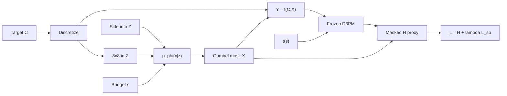

# Active Data Acquisition with Side Information via Discrete Diffusion Priors

**An Vuong, Anthony Q. Nguyen, Thuan Nguyen, Thinh Nguyen**

*Oregon State University; East Tennessee State University*

**Keywords:** Entropy; mutual information; active sensing; discrete diffusion; side information.

---

## Abstract

Modern learning systems depend on high-fidelity data, yet acquisition is costly: higher measurement fidelity increases power, storage, and the risk of collecting irrelevant content, while aggressive cost reduction can discard information critical to downstream analysis. We address this cost–fidelity trade-off with an information-theoretic framework that balances **specificity** and **generality**—acquiring data maximally relevant to a broad set of tasks without tying acquisition to any particular classifier. Mutual information serves as a model-agnostic relevance metric. We formulate budgeted pixel selection as Problem P4: choose a mask distribution $p(x \mid z)$, conditioned on side information $z$, to maximize $I(Y; C)$ between a target discrete image $C$ and a partial observation $Y$, subject to sparsity constraints on the sensing action $X$. Because $H(C)$ is independent of the mask, this is equivalent to minimizing $H(C \mid Y)$. The acquisition problem is inherently hard in high dimensions; when $p(y \mid x, c)$ is unknown, we approximate it with a **frozen Discrete Denoising Diffusion Probabilistic Model (D3PM)** that supplies a differentiable conditional-entropy surrogate. A spatial mask network implements $p_\phi(x \mid z)$ with masked-only entropy, empirical sparsity–timestep calibration, and Gumbel-Softmax relaxation. On MNIST, the proxy $H(C \mid Y)$ decreases from $0.029$ to $0.006$ over 40 epochs while respecting sparsity budgets. We then stress-test the framework on a real inverse problem—Cartesian phase-encode selection for accelerated MRI on fastMRI—where the proxy can be scored against reconstruction error rather than against itself. **The framework does not survive that test in its conditional form.** Under a budget-exact, held-out protocol, the entropy proxy disagrees with reconstruction quality; conditioning the mask on per-slice side information is worth at most $2\%$ and only at the tightest budget; and a $300$-number average of per-row k-space energy outperforms the learned policy. What does work is optimising the *discrete* mask directly against a reconstructor: a learned static mask beats variable-density sampling by $1.5$–$3.8\%$ NMSE under a reconstructor it never saw during optimisation. We report the negative results, the controls that establish them, and a metric defect that inverted two of our own earlier conclusions, and release the modular `itw/` package.

---

## 1 Introduction

Modern data science increasingly relies on analyzing large volumes of data—often, the more data, the better. However, the **quality** of the data is heavily influenced by how it is acquired. Accurate, comprehensive sensing can yield high-fidelity measurements, but at the cost of increased power consumption, bandwidth, storage, and processing time, and may also raise the risk of collecting information irrelevant to the target application. Conversely, reducing acquisition cost can lower fidelity and cause loss of information crucial to downstream tasks such as classification, segmentation, or generative modeling.

Consider **budgeted pixel sensing**. In medical imaging, remote sensing, bandwidth-limited transmission, or interactive annotation, only a fraction of pixels may be measured or labeled. The design question is not merely *how many* pixels to observe, but *which* locations carry the most information about the full scene under a fixed budget—analogous to optimizing radar transmit parameters to target effective frequency ranges while avoiding unnecessary power use. A highly task-specific policy (e.g., pixels chosen only to help one classifier) can produce an overly specialized dataset that excludes information needed for related tasks. Ideally, we collect data rich and versatile enough to support not only the immediate task but similar, yet unspecified, ones.

We adopt an **information-theoretic perspective** that balances specificity and generality. Rather than optimizing acquisition solely to improve one learning algorithm, we seek measurements whose relevance is measured by **mutual information**—a robust, model-agnostic quantity not tied to a particular hypothesis class (Cover and Thomas 2006). As illustrated in our pipeline (Figure 1), we select a sensing action $X$ (a binary pixel mask) based on **side information** $Z$—class label, a coarse image summary, and a sparsity target—to produce a measurement $Y$ that shares maximal information with the target $C$.

In prior work (Vuong et al. 2025), we showed that when probabilistic acquisition models are unknown, deep networks can learn effective masks by combining a U-Net generator with **MINE** (Belghazi et al. 2018) to estimate $I(Y; C)$ on continuous CelebA images. **This paper** extends that line to **discrete** images and replaces the separate MI estimator with a **frozen absorbing-state D3PM** (Austin et al. 2021) as a conditional-entropy proxy for $H(C \mid Y)$, coupled with masked-only aggregation, empirical calibration between mask density and diffusion timestep, and Gumbel-Softmax training. The D3PM weights remain fixed; only the mask generator is updated.

### Contributions

- We cast active data acquisition with side information as **Problem P4**—maximizing $I(Y; C)$ under sparsity constraints—and implement it for discrete images via minimization of a D3PM-based $H(C \mid Y)$ proxy.
- We introduce **masked-only entropy**, restricting the proxy to observed pixels so gradients target informative locations rather than trivial absorbed regions.
- We propose **empirical sparsity–timestep calibration** mapping mask density to D3PM noise level via pixel survival under the forward absorbing process.
- We **stress-test the framework on accelerated MRI**, where masks can be scored by reconstruction error rather than by the proxy that selected them, and report three negative results: the entropy proxy anti-correlates with reconstruction quality at the tightest budget; instance-adaptive conditioning does not pay; and a $300$-parameter energy average beats the learned policy under zero-filled reconstruction.
- We show that **mask ranking is reconstructor-dependent**—the energy-optimal mask is the best of all under zero-filled reconstruction and the worst once a learned prior exists—which explains the failure and dictates what a sampling objective must be trained against.
- We contribute an **evaluation protocol and two controls** that this literature does not routinely apply: a scout-derangement test that isolates whether conditioning is used at all, and a held-out *judge* reconstructor that separates genuine mask quality from overfitting to the reconstructor used during optimisation (worth up to $1.5$ pp here).
- We release a modular `itw/` package with spatial and row mask architectures, a reconstructor, budget-exact seeded evaluation, and Jupyter workflows for MNIST and CIFAR-10.

---

## 2 Related Work

**Target detection and radar.** Object identification via radar and related sensors has been studied extensively with model-driven methods leveraging physical laws (Kay 1998) and, more recently, data-driven detectors (Han et al. 2021). Unlike these approaches, we do not propose a specific detection or classification algorithm; we optimize the **information content** of acquired measurements for downstream use under resource constraints.

**Learned sampling for MRI.** Variable-density random sampling with a fully
sampled low-frequency block is the standard heuristic for Cartesian
compressed-sensing MRI (Lustig, Donoho, and Pauly 2007). Learning the pattern
instead has two established lines: *combinatorial* selection, where masks are
built greedily to minimize reconstruction error on a training set (Gözcü et al.
2018), and *relaxation-based* selection, where a differentiable probabilistic
mask is trained jointly with a reconstruction network (Bahadir et al. 2020).
**We claim neither as novel**; our MRI experiments deliberately re-derive both
in order to test whether an information-theoretic, instance-adaptive policy
improves on them. It does not, and our strongest MRI result is obtained by the
combinatorial route. What we add is the diagnosis of *why* the
information-theoretic route fails, and the controls that establish it.

**Active learning.** Active learning selects informative samples for labeling to improve a particular model when labels are expensive (Guo and Greiner 2007). Most methods are tailored to a classifier. We instead maximize mutual information, decoupling acquisition from any single learning algorithm. Shayovitz and Feder (2023) minimize conditional information in a universal active-learning framework; our emphasis is **spatial acquisition masks** under explicit pixel budgets rather than label querying.

**Prior ITW acquisition work.** Vuong et al. (2025) formulate Problems P1–P4 for active acquisition with side information, characterize solutions at extreme points of convex constraints, and propose MINE-based blind estimation with U-Net masks on CelebA, where masks emphasize high-frequency structure (edges, hair). We inherit the P4 formulation and side-information architecture but move to discrete state spaces and a D3PM prior.

**Discrete diffusion.** D3PMs (Austin et al. 2021) extend denoising diffusion to categorical data via structured transition matrices, including absorbing-state kernels aligned with masked prediction. Our codebase implements absorbing-state D3PM with cosine $\beta$ scheduling in PyTorch (Ryu 2024). Absorbing state $0$ represents progressive corruption toward a mask token—conceptually aligned with partial observations $Y$.

**Continuous diffusion.** DDPMs (Ho et al. 2020) underpin much of generative modeling; DiT (Peebles and Xie 2023) replaces U-Nets with transformers and serves as the CIFAR-10 backbone. Our setting requires **discrete** states and explicit mask tokens.

**Differentiable discrete masks.** Gumbel-Softmax (Jang, Gu, and Poole 2017; Maddison, Mnih, and Teh 2017) enables gradient-based learning over binary structures via relaxation and straight-through estimation.

**Information-theoretic diffusion.** Recent work relates denoising objectives to information quantities in masked diffusion (Nie et al. 2025). Our proxy is simpler—sum of per-pixel categorical entropies from a frozen $c_0$-predictor—but points toward tighter variational bounds as future work.

---

## 3 Problem Description

### 3.1 Notation

| Symbol | Description |
|--------|-------------|
| $C$, $p(c)$ | Target discrete image and its distribution |
| $X$, $p(x \mid z)$ | Sensing action (binary mask) and its conditional distribution |
| $Y$, $p(y \mid x, c)$ | Measurement (partial observation) and its distribution |
| $Z$, $p(z \mid c)$ | Side information (label, coarse image, sparsity budget) |

An active data acquisition model with side information is specified by $p(c)$, $p(z \mid c)$, and $p(y \mid x, c)$. We parameterize $p(x \mid z)$ with a neural network $p_\phi(x \mid z)$ rather than enumerating extreme points of the probability simplex (Vuong et al. 2025).

### 3.2 Acquisition Model

Images are discretized to $N$ bins per channel: $C \in \{0,\ldots,N-1\}^{C_{\mathrm{ch}} \times H \times W}$. A mask $X \in [0,1]^{1 \times H \times W}$ (binary at inference) selects observed pixels. The measurement is:

$$Y = f(C, X),$$

where $f$ sets unobserved locations to absorbing state $0$. For binary MNIST ($N=2$), $f(C,X) = X \odot C$. For multi-channel CIFAR ($N=8$), observed bins are remapped to $\{1,\ldots,N-1\}$ so that $0$ exclusively denotes "masked."

Side information $Z$ comprises the class label $c$, an $8 \times 8$ grayscale summary of $C$ (via average pooling), and a target sparsity $s = \mathbb{E}[X]$ drawn per batch from $\mathcal{U}(s_{\min}, s_{\max})$.

### 3.3 Problem P4 and Equivalence

With side information, the primary formulation is:

$$\max_{p(x \mid z)} \; I(Y; C) \quad \text{subject to} \quad g_i\bigl(p(x \mid z)\bigr) \le 0, \; i = 1,\ldots,N_c.$$

Related problems P1–P3 maximize $I(X,Y;C)$ or $I(Y;C)$ without conditioning on $Z$ (Vuong et al. 2025). We focus on **P4** because the mask policy should adapt to available context. A typical cost constraint is expected sparsity: $\mathbb{E}[\sum_i X_i] = s \cdot HW$, enforced during training via $\mathcal{L}_{\mathrm{sparsity}} = \mathbb{E}[(\bar{X} - s)^2]$.

Since $I(Y; C) = H(C) - H(C \mid Y)$ and $H(C)$ does not depend on $X$, maximizing mutual information is equivalent to minimizing conditional entropy $H(C \mid Y)$. Direct estimation of $H(C \mid Y)$ for high-dimensional discrete images is intractable; §4 describes our D3PM surrogate.

### 3.4 Computational Challenge

Vuong et al. (2025) show that optimal solutions to P1–P4 lie at extreme points of convex feasible regions; enumerating them is NP-hard in high dimensions. When $p(y \mid x, c)$ and related models are **known**, iterative methods such as CCCP can approximate solutions. In practice, for image masking, we use a parametric $p_\phi(x \mid z)$ and a differentiable surrogate for $H(C \mid Y)$.

---

## 4 Neural Blind Estimation

### 4.1 When Models Are Unknown

When $p(y \mid x, c)$ is unavailable, Vuong et al. (2025) train two networks: one for $p(x \mid z)$ (U-Net) and one for $I(Y; C)$ (MINE), with deterministic $Y = X \odot C$ and $Z = G * C$ (Gaussian blur). Sparsity is encouraged via a logarithmic mask penalty combined with $\mathcal{L}_{\mathrm{MINE}}$. This works on continuous CelebA faces, where learned masks emphasize high-frequency regions (edges, hair); Fourier-domain experiments confirm preference for high-frequency components. MINE can exhibit high variance, and continuous formulations do not directly apply to quantized discrete images.

### 4.2 D3PM Conditional-Entropy Proxy

We replace MINE with a **frozen** pretrained D3PM that models $p(C)$ and supplies per-pixel predictive uncertainty given corrupted input. A D3PM defines forward transitions $q(c_t \mid c_{t-1})$ and a denoiser $p_\theta(c_0 \mid c_t, t, c_{\mathrm{lbl}})$ with class label $c_{\mathrm{lbl}}$. We use **absorbing** forward diffusion: each pixel stochastically transitions to state $0$ with rate $\beta_t$.

| Component | MNIST | CIFAR-10 |
|-----------|-------|----------|
| Backbone | `DummyX0Model` (conv U-Net) | `DiT_Llama` ($d{=}1024$) |
| Classes $N$ | 2 | 8 |
| Steps $T$ | 1000 | 1000 |
| Schedule | Cosine $\beta$ | Cosine $\beta$ |
| Checkpoint | `model_absorb_cosine_399.pth` | `model_absorb_cosine_499.pth` |

All D3PM parameters are frozen during mask training. Given $Y$, timestep $t$, and label $c_{\mathrm{lbl}}$, the D3PM outputs logits $\hat{z} = \mathrm{D3PM}(Y, t, c_{\mathrm{lbl}})$. Per-pixel Shannon entropy is:

$$H_i = -\sum_{k=0}^{N-1} p_i(k) \log p_i(k), \quad p_i = \mathrm{softmax}(\hat{z}_i).$$

**Masked-only aggregation** (critical for correct gradients):

$$\mathcal{H}_{\mathrm{proxy}} = \frac{1}{\sum_i X_i} \sum_i X_i \cdot H_i.$$

Summing over all pixels—including masked sites fixed at $0$—allows trivial certainty on unobserved locations and does not reflect informativeness of selected pixels.

### 4.3 Sparsity–Timestep Calibration

D3PM expects inputs at a specific noise level $t$. A mask keeping fraction $s$ of pixels resembles forward corruption where roughly fraction $s$ of pixels retain their clean value. We build an **empirical survival table** $\mathbf{S} \in [0,1]^T$:

$$S_t \approx \mathbb{E}_{C}\left[\frac{1}{HWC_{\mathrm{ch}}}\sum_{i}\mathbf{1}[c_t^{(i)} = c_0^{(i)}]\right],$$

estimated by Monte Carlo over training batches. Given $s$:

$$t(s) = T - \mathrm{searchsorted}(\mathbf{S}, s).$$

This replaces an earlier heuristic using cumulative $\prod(1-\beta_t)$ calibrated on ink mass rather than pixel fraction. *Implementation note:* `torch.searchsorted` requires ascending values; flip the decreasing survival curve before lookup.

### 4.4 Mask Generator $p_\phi(x \mid z)$

**Spatial (default).** The $8 \times 8$ summary in $Z$ is concatenated with Fourier features of $s$ and processed by a conv encoder–decoder upsampling to $32 \times 32$ with 2-way logits per pixel (analogous to the U-Net role in prior work). MNIST adds a class embedding.

**MLP baseline.** Label and $s$ embed into a vector mapped to independent pixel logits—image-blind, for ablation only.

On MNIST, informative masks qualitatively concentrate on stroke regions (edges), consistent with the high-frequency emphasis observed on CelebA in prior work.

### 4.5 Training Objective

Binary masks are sampled with Gumbel-Softmax temperature $\tau$ annealed from $1.0$ to $0.5$. Parallel to $\mathcal{L} = \mathcal{L}_{\mathrm{MINE}} + \mathcal{L}_{\mathrm{mask}}$ in prior work:

$$\mathcal{L} = \mathcal{H}_{\mathrm{proxy}} + \lambda \cdot \mathcal{L}_{\mathrm{sparsity}}, \quad \mathcal{L}_{\mathrm{sparsity}} = \mathbb{E}\left[(\bar{X} - s)^2\right].$$

Gradients flow through $Y$ and $X$ into $p_\phi$; D3PM weights receive no updates.

---

## 5 Experiments: MNIST and CIFAR-10

### 5.1 Setup

| Setting | MNIST | CIFAR-10 |
|---------|-------|----------|
| Mask architecture | Spatial | Spatial |
| Batch size | 512 | 256 |
| Learning rate | $3 \times 10^{-4}$ | $2 \times 10^{-5}$ |
| $\lambda$ (sparsity) | 10.0 | 1.0 |
| Sparsity range | $[0.05, 0.95]$ | $[0.1, 0.9]$ |
| Gumbel $\tau$ | $1.0 \rightarrow 0.5$ | $1.0 \rightarrow 0.5$ |
| Epochs | 200 | 200 |

### 5.2 Evaluation Protocol

`itw/eval.py` compares learned masks against **random masks** with matched sparsity. Metrics: $\mathcal{H}_{\mathrm{learned}}$, $\mathcal{H}_{\mathrm{random}}$, $\Delta H = \mathcal{H}_{\mathrm{random}} - \mathcal{H}_{\mathrm{learned}}$ (higher is better), and sparsity error $|\bar{X} - s|$.

### 5.3 Results

**MNIST.** Training logs show consistent decrease in the entropy proxy:

| Epoch | $\mathcal{H}_{\mathrm{proxy}}$ | $\mathcal{L}_{\mathrm{sparsity}}$ | $\tau$ |
|-------|------------------------------|-----------------------------------|--------|
| 0 | 0.029 | 0.0008 | 1.00 |
| 10 | 0.008 | 0.0002 | 0.97 |
| 29 | 0.007 | 0.0003 | 0.93 |
| 39 | 0.006 | 0.0002 | 0.90 |

The proxy drops roughly $4\times$ while sparsity loss remains below $10^{-3}$.

**CIFAR-10 (pre-fix runs).** Earlier experiments *without* masked-only entropy showed $\mathcal{H}_{\mathrm{proxy}}$ **increasing** over epochs (e.g., $0.24 \rightarrow 0.49$) despite falling sparsity loss—motivating the methodological fixes here. Re-training with `itw/` is required for valid CIFAR conclusions.

### 5.4 Reproducibility

- MNIST: `20260415_itw_mnist.ipynb`
- CIFAR: `20260416_itw_cifar10.ipynb`
- Library: `from itw import MNISTConfig, train_mask_generator`
- Artifacts: `models_mask_gen_mnist/`, `models_mask_gen_cifar10/`

---

## 6 Accelerated MRI: a stress test

MNIST and CIFAR-10 evaluate the proxy against itself: the quantity reported
($\mathcal{H}_{\mathrm{proxy}}$) is the quantity optimized. Accelerated MRI
breaks that circularity. The action is a Cartesian phase-encode (PE) row mask
under a line budget, and the mask can be scored by reconstruction error, which
the policy never sees.

### 6.1 Setup

fastMRI single-coil (Zbontar et al. 2018), one mid-slice per volume: 973 train
and **199 held-out validation** files at $300 \times 300$. The action is a
300-row mask with a 32-row auto-calibration (ACS) block locked on; the budget is
enforced exactly by top-$k$ selection, so every method compares at identical
density. Side information $Z$ is a central scout reconstruction. We report
per-slice $\mathrm{NMSE} = \lVert \hat{c} - c \rVert^2 / \lVert c \rVert^2$,
averaged over slices; stochastic baselines are averaged over 5 seeds and a
margin inside $2$ standard deviations is not counted as a win.

Two reconstructors are trained on the training split under *heuristic* masks
only, so neither ever sees a learned mask: **U-Net A**, against which masks are
optimized, and **U-Net B**, an independently initialized *judge* used only for
scoring. All reported numbers are U-Net B.

### 6.2 The proxy does not transfer

Three results, each on held-out data:

**The entropy proxy disagrees with reconstruction quality.** At $s = 0.25$ the
learned policy attains the lowest coarse proxy entropy $\mathcal{H}_c$ of any
method and still loses on NMSE to every heuristic tested. Lower proxy entropy
does not imply a better mask.

**A 300-number average beats the learned policy.** Mean per-row k-space energy,
fit on the training split, beats the learned policy at every sparsity under
zero-filled reconstruction ($+5.1\%$, $+0.5\%$, $+2.9\%$, $+3.6\%$ at
$s = 0.25, 0.40, 0.50, 0.75$). The policy is approximating that profile slightly
worse: its row-selection frequency correlates $r = 0.93$ with the
variable-density prior and $0.83$ with log row energy, with $77$–$81\%$ row
overlap.

**Conditioning is barely used.** Replacing each slice's scout with *another
slice's* (a derangement with no fixed points) changes NMSE by $-0.35\%$ to
$-0.80\%$ on average—the wrong scout is mildly *better*. The effect is
sparsity-dependent: at $s = 0.25$ the correct scout does help ($+0.7\%$ under
the judge), while at $s \geq 0.40$ conditioning is mildly harmful. Collapsing
the policy to a single static mask is free or better at $s \geq 0.40$. The
conditional architecture does not earn its complexity.

### 6.3 Mask ranking is reconstructor-dependent

The failure has a mechanism. Replacing zero-filled reconstruction with the judge
at $s = 0.25$:

| mask | zero-filled | U-Net B | gain |
|------|-------------|---------|------|
| ACS + equispaced | 0.03820 | 0.02591 | 32.2% |
| ACS + random | 0.03819 | 0.02661 | 30.3% |
| ACS + variable density | 0.03382 | 0.02450 | 27.5% |
| learned, static | 0.03470 | 0.02897 | 16.5% |
| learned, adaptive | 0.03318 | 0.02785 | 16.1% |
| energy oracle | 0.03147 | 0.02703 | 14.1% |

Masks that **spread out** gain most from a reconstructor; **center-concentrated**
masks gain least. A reconstructor carrying a prior already predicts the
low-frequency center, so budget spent there is redundant. The energy oracle—the
best mask of all under zero-filled reconstruction—becomes the worst once a prior
exists.

This is why the information-theoretic policy underperforms: it was trained on
zero-filled reconstruction error plus a coarse-entropy term, **both of which
reward energy capture**, which is precisely the wrong signal once the
reconstructor improves. The objective was not wrong about its own criterion; the
criterion was the wrong one.

### 6.4 What does work

Optimizing the discrete mask directly against a reconstructor. Gradient-based
relaxation (a straight-through top-$k$ over a 300-parameter row profile, in the
spirit of Bahadir et al. 2020) loses to variable density at every sparsity. A
greedy row-swap search on the *hard* mask—gradient proposes candidate swaps,
exact evaluation accepts them, in the spirit of Gözcü et al. 2018—wins:

| $s$ | learned static mask | ACS + variable density | gain | |
|-----|--------------------|------------------------|------|--|
| 0.25 | **0.02355** | 0.02450 $\pm$ 0.00006 | $+3.79\%$ | $> 2$ sd |
| 0.40 | **0.01842** | 0.01873 $\pm$ 0.00005 | $+2.14\%$ | $> 2$ sd |
| 0.50 | **0.01521** | 0.01538 $\pm$ 0.00007 | $+1.49\%$ | $> 2$ sd |
| 0.75 | 0.00763 | 0.00764 $\pm$ 0.00001 | $+0.18\%$ | ties |

It is the best mask tested at every sparsity, and it also beats variable density
under plain zero-filled reconstruction at three of four sparsities, so it is not
exploiting one reconstructor's quirks. The gap between the relaxed and
combinatorial optimizers is not small: the relaxed profile lost by $1.5$–$2.3\%$
where the discrete search won by $1.5$–$3.8\%$, on the same objective and data.

### 6.5 Two controls worth adopting

**The judge matters.** Scored against the reconstructor it was optimized
against, the relaxed profile reads $-0.49\%$ versus variable density at
$s = 0.40$; against an independently trained judge it reads $-1.97\%$. A full
$1.5$ pp of apparent mask quality was overfitting to one reconstructor. Any
learned-sampling result scored on its own reconstructor should be read with this
in mind.

**A metric defect inverted two of our own conclusions.** Our NMSE implementation
clamped the denominator $\lVert c \rVert^2$ at an absolute $10^{-8}$. FastMRI
magnitude is $\sim 10^{-6}$, so $\lVert c \rVert^2 \approx 4.2 \times 10^{-9}$
for a median slice and the floor was active on $64\%$ of training and $67\%$ of
validation slices, silently converting NMSE to a constant-scaled MSE on exactly
the low-energy images and reading $\sim 4\times$ low. Correcting it reversed the
sign of our scout-derangement result at $s = 0.25$ and removed a claimed win for
the learned static mask. Every MRI number above is post-correction. We report
this because the defect is invisible to any test that only checks relative
ordering within one metric.

---

## 7 Discussion and Limitations

**MINE vs. D3PM proxy.** MINE requires a separate critic network and can be unstable; the D3PM proxy reuses a generative prior trained on the data distribution, avoids adversarial estimation, and handles discrete categorical states natively—at the cost of assuming the D3PM captures relevant uncertainty.

**Proxy validity.** $\mathcal{H}_{\mathrm{proxy}}$ is entropy of a frozen $c_0$-predictor, not rigorous $H(C \mid Y)$ under the true posterior. The D3PM was trained on forward-noised inputs, not arbitrary mask patterns.

**Timestep alignment.** Matching $s$ to $t$ via pixel survival is heuristic; masked images are spatially structured whereas forward corruption is i.i.d. per pixel.

**CIFAR quantization.** Remapping observed bins introduces minor aliasing at the brightest level.

**Baselines.** Quantitative comparison to saliency or compression masks is not yet reported. Scope is **mask-only active acquisition**; coupling masks to D3PM reverse sampling is future work.

**The prior is not load-bearing in the MRI result.** This is the central
limitation. The frozen D3PM contributes nothing to the winning MRI mask, which
is produced by combinatorial search against a reconstructor. On MNIST the proxy
decreases, but nothing independent of the proxy confirms the resulting masks are
better; MRI is the one setting here with such an independent criterion, and
there the proxy fails it. We therefore do not claim the D3PM surrogate is
validated as an acquisition objective. A fair reading is that it is validated as
an *optimizable* quantity and unvalidated as a *useful* one.

**Why the negative result may be specific.** The fine-resolution prior is flat in
cross-entropy across timesteps, so it supplies no usable gradient and was
disabled ($\beta = 0$) in all MRI runs; only the coarse row-profile prior is
active. A stronger prior—or a diffusion posterior sampler used as the
reconstructor rather than a U-Net—could change the conclusion, and our own
results show the optimal mask moves when the reconstructor does.

**Scale.** Single-coil, one mid-slice per volume, 973 training images, and
reconstructors of 1.9M/4.3M parameters. Multi-coil data, full volumes, and a
stronger reconstructor could all move these numbers.

**Local optimality.** The combinatorial search stops when no single row swap
among 24 gradient-proposed candidates improves; it is a local optimum, not a
global one.

---

## 8 Conclusion

We presented an information-theoretic framework for active data acquisition with
side information under resource constraints, extending prior MINE-based blind
estimation to **discrete images** via a frozen D3PM conditional-entropy
surrogate, and combining masked-only entropy, sparsity–timestep calibration, and
Gumbel-Softmax mask training. On MNIST the surrogate optimizes cleanly.

Tested on accelerated MRI—where masks can be scored by a criterion the policy
never sees—the framework does not hold up in its conditional form. The proxy
disagrees with reconstruction quality, per-slice conditioning is worth at most
$2\%$, and a 300-number energy average outperforms the learned policy. The
mechanism is that mask ranking is **reconstructor-dependent**: an objective built
on zero-filled error and prior entropy rewards energy capture, which is exactly
what a reconstructor with a prior makes redundant. Optimizing the discrete mask
against the reconstructor instead yields a static mask that beats variable
density by $1.5$–$3.8\%$ NMSE under a held-out judge.

We take two lessons to be more durable than the specific numbers. First, an
acquisition objective must be trained against the estimator that will actually
be used, because the optimal measurement set is a property of the pair, not of
the signal alone. Second, a surrogate that decreases under its own optimization
is not thereby validated; the MNIST and MRI results differ precisely in whether
an independent criterion was available. We release `itw/` with the held-out
protocol, the derangement and judge controls, and the reconstructor, so that
both the positive and negative results here can be checked and contested.

---

## References

1. Austin, J.; Johnson, D. D.; Ho, J.; Tarlow, D.; and Van Den Berg, R. 2021. Structured Denoising Diffusion Models in Discrete State-Spaces. *NeurIPS* 34: 17981–17993.

2. Bahadir, C. D.; Wang, A. Q.; Dalca, A. V.; and Sabuncu, M. R. 2020. Deep-Learning-Based Optimization of the Under-Sampling Pattern in MRI. *IEEE Transactions on Computational Imaging* 6: 1139–1152.

3. Belghazi, M. I.; Baratin, A.; Rajeshwar, S.; Ozair, S.; Bengio, Y.; Courville, A.; and Hjelm, R. D. 2018. Mutual Information Neural Estimation. *ICML*: 531–540.

4. Cover, T. M.; and Thomas, J. A. 2006. *Elements of Information Theory*. Wiley, 2nd edition.

5. Gözcü, B.; Mahabadi, R. K.; Li, Y.-H.; Ilıcak, E.; Çukur, T.; Scarlett, J.; and Cevher, V. 2018. Learning-Based Compressive MRI. *IEEE Transactions on Medical Imaging* 37(6): 1394–1406.

6. Guo, Y.; and Greiner, R. 2007. Active Learning for Semi-Supervised Support Vector Machines. *UAI*.

7. Han, S.; Yan, L.; Zhang, Y.; Addabbo, P.; Hao, C.; and Orlando, D. 2021. Adaptive Radar Detection and Classification Algorithms for Multiple Coherent Signals. *IEEE Transactions on Signal Processing* 69: 560–572.

8. Ho, J.; Jain, A.; and Abbeel, P. 2020. Denoising Diffusion Probabilistic Models. *NeurIPS* 33: 6840–6851.

9. Jang, E.; Gu, S.; and Poole, B. 2017. Categorical Reparameterization with Gumbel-Softmax. *ICLR*.

10. Kay, S. M. 1998. *Fundamentals of Statistical Signal Processing, Volume II: Detection Theory*. Prentice Hall.

11. Liu, Z.; Luo, P.; Wang, X.; and Tang, X. 2015. Deep Learning Face Attributes in the Wild. *ICCV*: 3730–3738.

12. Lustig, M.; Donoho, D.; and Pauly, J. M. 2007. Sparse MRI: The Application of Compressed Sensing for Rapid MR Imaging. *Magnetic Resonance in Medicine* 58(6): 1182–1195.

13. Maddison, C. J.; Mnih, A.; and Teh, Y. W. 2017. The Concrete Distribution. *ICLR*.

14. Nie, W.; et al. 2025. Large Language Diffusion Models.

15. Peebles, W.; and Xie, S. 2023. Scalable Diffusion Models with Transformers. *ICCV*: 4195–4205.

16. Ronneberger, O.; Fischer, P.; and Brox, T. 2015. U-Net: Convolutional Networks for Biomedical Image Segmentation. *MICCAI*: 234–241.

17. Ryu, S. 2024. Minimal Implementation of D3PM in PyTorch. `https://github.com/cloneofsimo/d3pm`

18. Shayovitz, E.; and Feder, M. 2023. Universal Active Learning. *IEEE Transactions on Information Theory*.

19. Vuong, A.; Nguyen, A. Q.; Nguyen, T.; and Nguyen, T. 2025. Active Data Acquisition: An Information Theoretic Approach. *IEEE Workshop on Computing, Networking and Communications (CNC)*.

20. Zbontar, J.; Knoll, F.; Sriram, A.; Murrell, T.; Huang, Z.; Muckley, M. J.; Defazio, A.; Stern, R.; Johnson, P.; Bruno, M.; et al. 2018. fastMRI: An Open Dataset and Benchmarks for Accelerated MRI. arXiv:1811.08839.

---

*Approximate length: 7 pages (AAAI two-column equivalent).*
